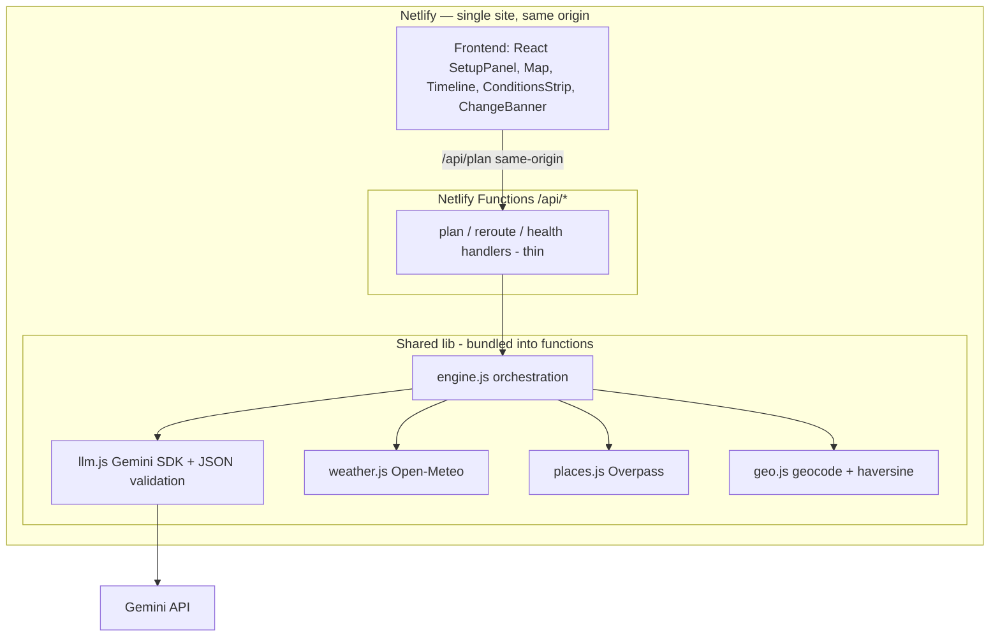

# TP Engine — Backend & v2 Architecture (Netlify + no-key data)

We have 2 hours. v2 makes the brief *real*: the backend pulls **live weather and real places (no API keys)**, so the engine senses conditions and reasons over actual candidates instead of inventing them. Gemini is the brain over real data, not the data source.

**Stack decisions locked:** ship on **Netlify** (frontend + serverless functions, one deploy, same origin). Data is **no-key**: Open-Meteo (weather + geocoding) and OpenStreetMap Overpass (places).

---

## 1. What changes from v1

| v1 (1 hour) | v2 (2 hours) |
|---|---|
| Claude invents places | Real POIs from OpenStreetMap (Overpass) |
| Disruptions are buttons only | Live weather (Open-Meteo) — the plan routes around forecast rain automatically |
| Browser → LLM via proxy | Netlify Functions backend: thin handlers + shared service/integration layers, validation |
| Timeline only | Map view + live conditions strip + travel-time gaps |

The reranking lever: **"real-time updates" stops being a button and becomes sensed reality.**

## 2. Architecture (one Netlify deploy)



Key lives only in Netlify env (`GEMINI_API_KEY`); never shipped to the client. Same-origin calls = no CORS config.

## 3. Stack

| Concern | Pick | Why |
|---|---|---|
| Runtime | **Netlify Functions** (Node, ES modules) | One deploy with the frontend; same origin. |
| LLM | **@google/genai** (Gemini) in a function | Key stays server-side. |
| Weather + geocode | **Open-Meteo** | Free, no key. Forecast + city→lat/lng. The unlock. |
| Places | **OSM Overpass API** | Free, no key. Real POIs by tag near coords. |
| Validation | **zod** | Validate request bodies *and* the model's JSON. |
| Tests | **vitest** | Unit + handler tests, fast and offline (mock integrations). |
| Security | netlify.toml headers + input caps + Netlify rate limiting | Serverless-appropriate hardening. |

## 4. The engine pipeline (the heart)

`POST /api/plan`:

1. **Validate** body (zod).
2. **Geocode** city → lat/lng (Open-Meteo geocoding API).
3. **Fetch weather** for the day → hourly forecast (rain probability, temp).
4. **Fetch candidate POIs** near center via Overpass, filtered by interests → ~15–20 candidates `{name, type, lat, lng}`.
5. **One Gemini call** over candidates + weather + constraints → a sequenced 5-stop day. The instruction that does the magic: *only pick from these candidates; prefer indoor ones during forecast-rainy hours; respect realistic travel time.*
6. **Validate** returned JSON (zod), **enrich** stops with coords from the candidate set, **compute travel gaps** (haversine + assumed speed).
7. Return.

`POST /api/reroute`: takes the current itinerary + a disruption (or fresh weather), re-runs step 5 for the *remaining* stops over the same candidate pool → revised plan + `change_summary` + `changed_ids`.

Because weather is real, the first plan already dodges forecast rain; the reroute button then handles *sudden* changes. Honest real-time story.

## 5. Endpoints (Netlify Functions 2.0)

Use the modern handler with a `config.path` so the route is a clean `/api/...` — no redirect needed:

```js
// netlify/functions/plan.js
import { plan } from "../../lib/engine.js";
import { validatePlanBody } from "../../lib/schema.js";

export default async (req) => {
  if (req.method !== "POST") return Response.json({ error: "POST only" }, { status: 405 });
  try {
    const body = validatePlanBody(await req.json());     // zod, throws on bad input
    const itinerary = await plan(body);                  // orchestration in lib/
    return Response.json(itinerary);
  } catch (e) {
    return Response.json({ error: "plan_failed", code: e.code ?? "unknown" }, { status: 400 });
  }
};

export const config = { path: "/api/plan" };
```

Shapes:
```
GET  /api/health   -> { ok: true }

POST /api/plan
body:  { city, prefs, budget, pace, date }
200:   { city, summary, weather:{ summary, hourly:[...] },
         stops:[ { id, time, title, type, why, cost, lat, lng, durationMin, travelFromPrevMin } ] }

POST /api/reroute
body:  { itinerary, disruption, now }
200:   { ...itinerary, change_summary, changed_ids:[] }
```
On LLM/parse/integration failure, return the curated `FALLBACK` itinerary with `degraded: true` — the demo never dies.

## 6. Data integrations (all no-key)

- **Open-Meteo — geocoding:** `geocoding-api.open-meteo.com/v1/search?name=<city>` → lat/lng.
- **Open-Meteo — forecast:** `api.open-meteo.com/v1/forecast?latitude=..&longitude=..&hourly=precipitation_probability,temperature_2m` → hourly conditions for the day.
- **OSM Overpass — places:** query tourist/amenity tags within a radius of the center, e.g.
  ```
  [out:json];
  ( node["tourism"~"museum|gallery|attraction|viewpoint"](around:3000,LAT,LNG);
    node["amenity"~"restaurant|cafe"](around:3000,LAT,LNG);
    node["leisure"="park"](around:3000,LAT,LNG); );
  out body 40;
  ```
  Map tags → our `type` (sight/indoor/food/outdoor). Cap results (~40 → trim to ~20 best).
- **Travel time:** haversine + assumed walking/transit speed for the gap estimate. Real routing (OSRM public server) is a **stretch goal**, not core.

**Be a good OSM citizen:** send a descriptive `User-Agent`, keep volume low, and **ship a curated per-demo-city POI fallback** so a slow/down Overpass never breaks the demo.

## 7. Caching & efficiency

- Serverless functions are stateless between invocations, so **don't rely on in-memory caching**. For demo volume, fetching fresh each call is fine. (If you want caching, Netlify Blobs is the native option — but it's a nice-to-have, not v2 core.)
- **One Gemini call per action.** Pass candidates *into* the call so it reasons in a single pass — no chained calls.
- Cap candidates (~20) and stops (5); cap `max_tokens`. Disable the action button while a request is in flight.

## 8. Security (serverless-appropriate)

- Key only in Netlify env (`GEMINI_API_KEY`); never `VITE_`-prefixed; never in the bundle; `.env` git-ignored.
- **Security headers** via `netlify.toml` `[[headers]]` (CSP, `X-Content-Type-Options`, `Referrer-Policy`).
- **Validate + length-cap** every input with zod; render model output as **text only**, never HTML.
- **Rate limiting:** enable Netlify's rate-limiting on `/api/*` (in-memory limiting is unreliable in serverless). Input caps + server-side key already remove the main abuse vectors.
- Same-origin calls mean no permissive CORS to misconfigure.

## 9. Testing

- **vitest unit:** JSON parser (clean / fenced / trailing-prose / garbage→fallback); zod schema rejects malformed stops; haversine returns sane distances; tag→type mapping.
- **Handler tests:** import a function's `default` export, invoke it with a mock `Request`, assert the `Response` — mock the integration modules so tests run offline and fast.
- Documented manual dry-run: plan a rainy-day city → confirm indoor bias → fire each disruption.

## 10. Folder structure

```
tp-engine/
├── netlify.toml              # build config, headers, (functions dir)
├── index.html
├── package.json
├── src/                      # frontend (Vite/React)
│   ├── App.jsx
│   ├── components/           # SetupPanel, Map, Timeline, Stop, ConditionsStrip, ChangeBanner
│   └── api.js                # fetch wrappers to /api/*
├── lib/                      # shared backend logic (bundled into functions)
│   ├── engine.js             # pipeline orchestration
│   ├── llm.js                # Gemini SDK + JSON validation
│   ├── weather.js            # Open-Meteo (forecast + geocode)
│   ├── places.js             # Overpass
│   ├── geo.js                # haversine, type mapping
│   ├── schema.js             # zod
│   └── fallback.js           # curated per-city safety net
├── netlify/functions/        # thin handlers
│   ├── plan.js
│   ├── reroute.js
│   └── health.js
└── test/
```

## 11. Frontend / UX upgrades

- **Map view (Leaflet + free OSM tiles):** numbered markers for each stop + a line between them. Biggest visual win — judges *see* the day, and *see* it reshuffle on a reroute.
- **Live conditions strip:** real weather from the backend ("Rain likely 2–5pm") so the indoor-bias decision is visible.
- **Timeline with travel gaps:** "12 min walk" between stops makes feasibility feel real.
- **Reroute:** changed stops animate/highlight; `ChangeBanner` keeps `aria-live="polite"` so the explanation is announced.
- **States:** skeleton loaders; clear error + degraded ("offline mode") states.
- **Responsive + accessible:** mobile layout; semantic `<ol>`/`<li>`, labels, visible focus, WCAG AA contrast, non-color cue for changes, `prefers-reduced-motion`.
- **Design:** one distinctive editorial-travel aesthetic (characterful display serif + clean body, warm dominant color + one sharp accent). Avoid generic dashboard look.

## 12. Deployment (Netlify, single deploy)

1. `netlify.toml` at root:
   ```toml
   [build]
     command = "npm run build"
     publish = "dist"
     functions = "netlify/functions"
   [[headers]]
     for = "/*"
     [headers.values]
       X-Content-Type-Options = "nosniff"
       Referrer-Policy = "strict-origin-when-cross-origin"
   ```
2. Push to GitHub → on Netlify, **Add new site → import the repo**. It detects Vite, builds `dist`, and deploys `netlify/functions` automatically.
3. Set env vars in **Site configuration → Environment variables**: `GEMINI_API_KEY`, `GEMINI_MODEL` (e.g. `gemini-2.0-flash`, or `gemini-2.5-flash`). **No `VITE_` prefix.**
4. Frontend calls `/api/plan` etc. (same origin — `config.path` handles routing). Auto-deploys on every push.
5. `netlify dev` runs frontend + functions locally so local mirrors prod.

## 13. 2-hour build plan

| Time | Task |
|---|---|
| 0–10 | Scaffold: Vite frontend + `netlify/functions/health.js` + `netlify.toml`; confirm `netlify dev` serves `/api/health`. |
| 10–25 | `lib/weather.js` (Open-Meteo geocode + forecast — no key, quick win); test via a temp route. |
| 25–45 | `lib/places.js` (Overpass query + tag→type mapping + trim) + curated `fallback.js`. |
| 45–70 | `lib/engine.js` + `lib/llm.js` + zod → `/api/plan` returns a real itinerary. |
| 70–85 | `/api/reroute` over the same candidate pool. |
| 85–105 | Frontend: Leaflet map, conditions strip, travel-gap timeline, reroute highlight + `aria-live`. |
| 105–115 | netlify.toml headers + Netlify rate limiting, 2–3 vitest tests, design polish. |
| 115–120 | Push → Netlify deploy, README + live link, dry run twice. |

## 14. Still out of scope (own it)

Turn-by-turn routing, bookings, accounts, multi-day, group trips. They're the roadmap slide — a focused v2 that does one thing excellently beats a broad one that half-works.